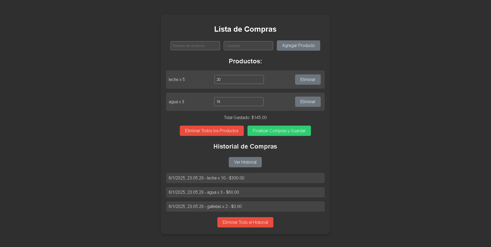

Este proyecto es una aplicación web para gestionar listas de compras que permite a los usuarios agregar productos, asignarles cantidades y precios, y realizar un seguimiento del gasto total. También incluye funcionalidades para almacenar y consultar un historial de compras.
 
<h1>Funcionalidades</h1> 
 
Agregar productos: Los usuarios pueden ingresar el nombre, cantidad y precio de los productos. 
Calcular el total: Se calcula y muestra el gasto total basado en las cantidades y precios ingresados. 
Eliminar productos: Los usuarios pueden eliminar productos individuales o borrar toda la lista. 
Guardar compras: Los datos de las compras realizadas se almacenan en el historial. 
Historial de compras: Los usuarios pueden consultar un historial con los detalles de compras anteriores. 
Eliminar historial: Se puede borrar completamente el historial de compras.

